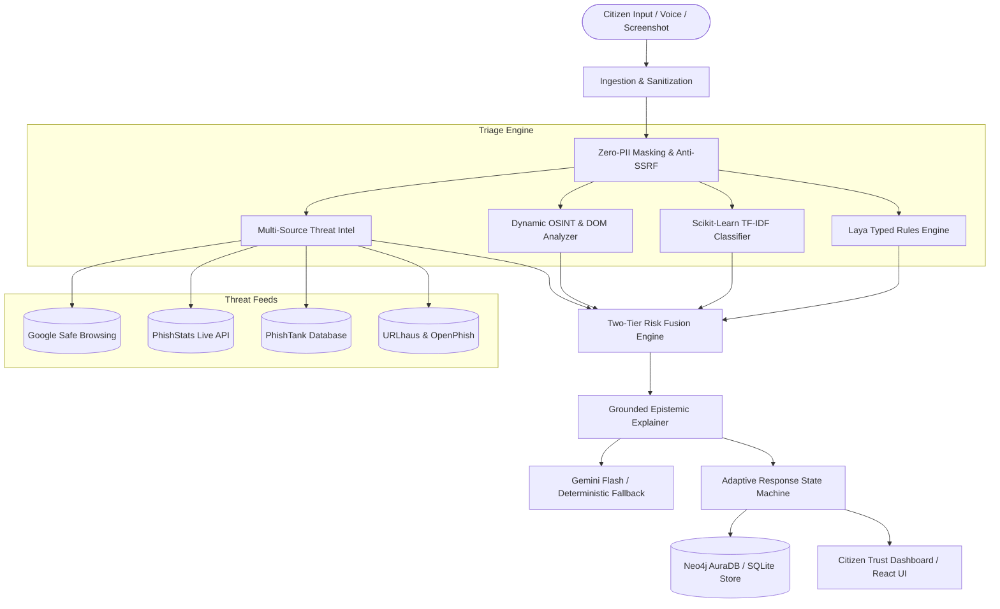

# Cyber Fraud Guardian (Cyber Kavach)

> **Cyber Kavach** — *National Citizen Cyber Threat Triage Platform*  

Cyber Fraud Guardian is a high-assurance, evidence-driven cyber fraud triage and reasoning system engineered to protect citizens from deceptive SMS, WhatsApp, email, social engineering, and payment fraud attacks.

Rather than relying on ungrounded LLM guesses or opaque black-box classifiers, Cyber Fraud Guardian enforces **strict epistemic modesty**, **two-tier risk fusion**, **traceable causal attack paths**, **multi-source threat intelligence**, **dynamic OSINT enrichment**, **graph database syndicate persistence**, and **state-proportional citizen response protocols** (including India's 1930 National Cyber Crime Golden Hour response).

---

## 1. Problem Statement

### What problem is being solved?
Indian citizens are increasingly targeted by sophisticated cyber fraud schemes, including:
- **Digital Arrest Extortion**: Impersonation of CBI, ED, state police, and judicial bodies via video call summons.
- **Utility & Service Disconnection**: Fake electricity bill alerts threatening midnight power disconnection with burner numbers.
- **Courier & Parcel Delivery Malvertising**: Fake India Post / courier delivery fee requests distributing credential-harvesting APKs.
- **Banking Typosquatting & Pan/Aadhaar e-KYC**: Lookalike domains mimicking SBI, HDFC, ICICI, or government portals.
- **Predatory Instant Loan Apps**: Collateral-free loan offers requiring excessive device permissions and harassment.
- **Deceptive Hyperlinks & Anchor Mismatches**: Legitimate-looking visible text masking malicious phishing destinations.

### Who faces this problem?
Everyday citizens, seniors, non-technical users, small business owners, and first responders who receive high volumes of deceptive messages across SMS, messaging apps, and email.

### Why does it matter?
Conventional classifiers give single opaque scores without explanation, while ungrounded LLMs hallucinate confirmations or provide false safety guarantees. Victims need immediate, transparent, evidence-based guidance and actionable recovery steps during the critical "Golden Hour."

### Scope of the Solution
Provides automated, privacy-preserving ingestion, deterministic indicator extraction, real-time threat intelligence verification, Scikit-Learn baseline classification, Laya typed decision rules, dynamic OSINT enrichment, graph-backed campaign correlation, and adaptive emergency advisory workflows.

---

## 2. Solution Overview

Cyber Fraud Guardian processes suspect messages through a multi-stage defensive pipeline:
1. **Ingestion & Sanitization**: Strips adversarial prompt injection attempts, masks sensitive personal identifiers (Aadhaar, PAN, OTPs, phone numbers), and defangs active URLs.
2. **Deterministic & Statistical Triage**:
   - **Laya Typed-Decision Rules**: Extracts urgency markers, Indian shortcodes, UPI VPAs, and brand claims.
   - **Scikit-Learn Classifier**: TF-IDF n-gram vectorizer paired with a trained classifier for sub-millisecond statistical confidence.
   - **Dynamic OSINT & Indicators**: Live DNS resolution, TLS certificate age/issuer checks, RDAP registrar query, anchor-text mismatch detection, and safe website DOM inspection.
3. **Multi-Source Threat Intelligence**:
   - Google Safe Browsing v4 Threat List API
   - PhishStats real-time phishing feed
   - PhishTank community-verified phishing database
   - URLhaus & OpenPhish feeds
4. **Two-Tier Risk Fusion**:
   - *Tier 1 Overrides*: Enforces absolute safety bounds (e.g. government/banking official domain dampening $\le 0.15$; confirmed malicious feed matches $\ge 0.85$).
   - *Tier 2 Fusion*: Multi-signal weighted linear combination bounded by an Evidentiary Sufficiency Gate (`SUFFICIENT`, `PARTIAL`, `INSUFFICIENT`).
5. **Grounded Epistemic Explanation**:
   - Gemini Flash-powered structured explainer enforcing strict inline evidence citations (`[Evidence N]`), clear separation between direct observations and security deductions, and explicit negative bounds (*"What the Guardian Cannot Conclude"*).
   - Deterministic offline template engine for complete air-gapped fallback.
6. **Adaptive Response & Graph Persistence**:
   - Tailored state machine guidance (`RECEIVED`, `CLICKED`, `ENTERED_CREDENTIALS`, `PAID` with India 1930 Helpline Golden Hour steps).
   - Neo4j AuraDB graph persistence for syndicate identification, incident history, and IDOR-safe citizen review.

---

## 3. Architecture & System Workflow

### Architecture Diagram



### End-to-End Processing Workflow
1. **Input Submission**: Citizen inputs text, URL, email headers, or speaks via real-time multilingual voice recognition.
2. **Pre-processing**: Normalizes text, sanitizes input, extracts IOCs (URLs, domains, IPs, UPI handles, sender shortcodes).
3. **Parallel Verification**:
   - Google Safe Browsing, PhishStats, and PhishTank query extracted URLs simultaneously.
   - OSINT modules query DNS, TLS, and RDAP records in real time.
   - ML classifier scores text patterns against trained fraud archetypes.
4. **Evidence Synthesis**: Synthesizes all signals into an append-only `IncidentEvidence` object with individual reliability ratings.
5. **Two-Tier Fusion**: Evaluates deterministic safety overrides and computes final calibrated risk tier (`LOW`, `MEDIUM`, `HIGH`, `CRITICAL`).
6. **Explanation & Advisory**: Emits structured reasons, attack stages (`Lure` $\rightarrow$ `Redirection` $\rightarrow$ `Exploitation` $\rightarrow$ `Monetization`), and state-dependent recovery steps.
7. **Graph Persistence**: Securely stores the incident node and relationships (`OWNS`, `CONTAINS_URL`, `HAS_DOMAIN`, `CLAIMS_BRAND`, `HAS_THREAT_INTEL`) in Neo4j AuraDB.

---

## 4. Key Features

- **Epistemic Modesty**: Signals are categorized into 6 epistemic states: `CONFIRMED`, `OBSERVED`, `SUSPICIOUS`, `POSSIBLE`, `UNKNOWN`, and `UNAVAILABLE`.
- **4-State Threat Feed Resilience**: Explicitly reports `KNOWN MALICIOUS`, `NO KNOWN MATCH`, `RATE LIMITED`, or `STANDBY (NO URL)`. Never assumes absence of a record equates to proof of safety.
- **Two-Tier Risk Overrides**: Protects legitimate banking and government communications (`*.gov.in`, `*.nic.in`, `*.sbi`) from false alarms while guaranteeing immediate escalation on confirmed threat intelligence hits.
- **Dynamic OSINT Verification**: Inspects domain age, TLS issuer trustworthiness, live DNS resolution, and deceptive HTML anchor discrepancies.
- **Dedicated ML Classifier**: Scikit-Learn TF-IDF pipeline providing fast statistical confidence scores alongside deterministic Laya rules.
- **Multilingual Support & Voice Input**:
  - Browser-native Web Speech API voice typing across 6 Indian locales (`en-IN`, `hi-IN`, `gu-IN`, `ta-IN`, `te-IN`, `bn-IN`).
  - Google Cloud Translation integration with offline dictionary fallbacks.
- **Citizen Journey Response**: Tailored action checklists for unclicked lures vs. clicked links vs. entered credentials vs. completed unauthorized payments.
- **Neo4j Aura Graph Database**: Correlates campaigns across disparate reports, tracks fraud syndicates, and maps shared infrastructure.
- **Citizen Account & IDOR Security**: Password hashing, session authentication, and ownership checks protecting incident histories.

---

## 5. Technology Stack

| Layer | Technologies |
|---|---|
| **Frontend** | React 18, Vite 6, Tailwind CSS, Lucide Icons, Browser Web Speech API |
| **Backend API** | Python 3.10+, FastAPI, Pydantic v2, Uvicorn, HTTPX (Async HTTP) |
| **Machine Learning** | Scikit-Learn (TF-IDF Vectorizer + Logistic Regression), NumPy |
| **AI / Reasoning** | Google Gemini Flash API (`gemini-2.0-flash-lite`), Rule-based deterministic fallback |
| **Datastores** | Neo4j AuraDB (Cloud Graph Database), SQLite (local evidence store) |
| **Threat Intelligence** | Google Safe Browsing v4, PhishStats REST API, PhishTank, URLhaus |
| **Security Controls** | SSRF CIDR validators, PII redactors, Sliding-window rate limiters, Security headers |
| **Testing** | Pytest, AnyIO, FastAPI TestClient |

---

## 6. AI/ML Methodology

### Scikit-Learn Statistical Classifier
- **Model**: Logistic Regression with word and character n-gram TF-IDF vectorization (n-gram range 1 to 2).
- **Purpose**: Rapid statistical triage of incoming messages to detect lexical cues of urgency, financial incentives, and credential solicitation.
- **Input**: Sanitized citizen message text.
- **Output**: Categorical prediction (`phishing`, `legitimate`, `suspicious`) with calibrated float confidence score ($0.0 \dots 1.0$).
- **Pipeline**: Automated text normalization $\rightarrow$ TF-IDF feature extraction $\rightarrow$ probability estimation.

### Laya Deterministic Rule Engine
- **Purpose**: High-precision detection of Indian-specific fraud vectors (telecom headers, 5-digit shortcodes, APK download links, fake electricity billing keywords).
- **Input**: Extracted IOCs, message text, and metadata.
- **Output**: Typed evidence items with confidence scores and specific regulatory references (TRAI, RBI, NPCI).

### Gemini Flash Epistemic Explainer
- **Model**: `gemini-2.0-flash-lite` (or configured Gemini model).
- **Purpose**: Generates citizen-comprehensible causal explanations strictly grounded in observed evidence items.
- **Contract Constraints**:
  - Must cite exact evidence items (`[Evidence 1]`, `[Evidence 2]`).
  - Strict prohibition against inventing unobserved technical facts (e.g. cannot claim a server is offline unless verified).
  - Explicit requirement to output *What Cannot Be Concluded*.
  - Automatic fallback to pre-compiled deterministic templates if the external LLM API is unavailable, unconfigured, or rate-limited.

---

## 7. Security & Privacy Controls

- **Zero-PII Masking**: Indian Aadhaar numbers (`\d{4}\s\d{4}\s\d{4}`), PAN cards (`[A-Z]{5}[0-9]{4}[A-Z]`), OTP tokens, and personal phone numbers are redacted prior to logging or upstream API transmission.
- **Anti-SSRF Protection**: Resolves all domains before fetching; blocks loopback (`127.0.0.0/8`), private RFC1918 subnets (`10.0.0.0/8`, `172.16.0.0/12`, `192.168.0.0/16`), and cloud metadata IP addresses (`169.254.169.254`).
- **Secret Scrubbing**: API keys, database passwords, and auth tokens are stripped from error messages, logs, and stack traces.
- **Rate Limiting**: Configurable sliding-window rate limiter on all public endpoints to prevent resource exhaustion.
- **IDOR Defense**: All incident queries and graph traversals verify authenticated ownership prior to data retrieval.
- **Strict Content Security**: Configures `X-Content-Type-Options: nosniff`, `X-Frame-Options: DENY`, `Referrer-Policy: strict-origin-when-cross-origin`, and parameterized Cypher/SQL queries.

---

## 8. Installation & Setup

### Prerequisites
- Python 3.10, 3.11, or 3.12
- Node.js 18+ and npm
- Git

### 1. Clone Repository
```bash
git clone https://github.com/ShafinNigamana/Cyberkawach_Hackathon_unoffical.git
cd Cyberkawach_Hackathon_unoffical
```

### 2. Backend Setup
```bash
# Create and activate virtual environment
python -m venv venv

# Windows:
venv\Scripts\activate
# Linux/macOS:
source venv/bin/activate

# Install dependencies
pip install -r requirements.txt
```

### 3. Frontend Setup
```bash
cd frontend
npm install
cd ..
```

### 4. Environment Configuration
Copy the provided `.env.example` to `.env`:
```bash
cp .env.example .env
```
*(On Windows Command Prompt: `copy .env.example .env`)*

Configure your environment variables as described in the section below. Note: **All external API keys are optional** — modules gracefully degrade if keys are omitted.

---

## 9. Environment Variables

| Variable | Required? | Default | Description |
|---|:---:|:---:|---|
| `GEMINI_API_KEY` | Optional | `None` | Google Gemini API key for dynamic grounded explanations. |
| `GEMINI_MODEL` | Optional | `gemini-2.0-flash-lite` | Gemini model version to utilize. |
| `SAFE_BROWSING_API_KEY` | Optional | `None` | Google Safe Browsing v4 Lookup API key. |
| `PHISHTANK_API_KEY` | Optional | `None` | PhishTank API key for verified phishing URL queries. |
| `PHISHSTATS_API_KEY` | Optional | `None` | PhishStats community API key (`psk_...`). |
| `GOOGLE_TRANSLATE_API_KEY` | Optional | `None` | Google Cloud Translation API key for dynamic multi-language text. |
| `NEO4J_ENABLED` | Optional | `false` | Set to `true` to persist incidents into Neo4j graph datastore. |
| `NEO4J_URI` | Optional | `neo4j+s://...` | Neo4j AuraDB instance URI. |
| `NEO4J_USERNAME` | Optional | `neo4j` | Neo4j database username. |
| `NEO4J_PASSWORD` | Optional | `None` | Neo4j database password. |
| `APP_ENV` | Optional | `development` | Application environment (`development` or `production`). |
| `APP_PORT` | Optional | `8000` | Port for the FastAPI backend server. |
| `APP_HOST` | Optional | `0.0.0.0` | Host interface for FastAPI server. |
| `RATE_LIMIT_PER_MINUTE` | Optional | `30` | Request rate limit per minute per client IP. |
| `CORS_ORIGINS` | Optional | `http://localhost:3000,...` | Allowed CORS origins for API requests. |

---

## 10. Running the Application

### Start Backend API Server
From the project root:
```bash
python -m uvicorn backend.main:app --reload --port 8000
```
- API Documentation (Swagger UI): [http://localhost:8000/docs](http://localhost:8000/docs)
- Health Check: [http://localhost:8000/api/health](http://localhost:8000/api/health)

### Start Frontend Application
In a separate terminal:
```bash
cd frontend
npm run dev
```
- Application Dashboard: [http://localhost:3000](http://localhost:3000)

---

## 11. API Documentation

### Primary Endpoints

#### 1. Analyze Message / URL
- **Endpoint**: `POST /api/analyze`
- **Auth**: Optional (Associates incident with authenticated user if session header is present)
- **Request Body**:
```json
{
  "message": "Dear customer, your SBI NetBanking account will be blocked today. Update KYC immediately: http://malware.testing.google.test/testing/malware/",
  "input_type": "text",
  "user_state": "received",
  "language": "en"
}
```
- **Response**:
```json
{
  "incident_id": "INC-2026-A1B2C3D4",
  "input_type": "text",
  "message_preview": "Dear customer, your SBI NetBanking account will be blocked...",
  "risk": {
    "level": "CRITICAL",
    "score": 0.95,
    "confidence": 0.95,
    "evidence_sufficiency": "SUFFICIENT"
  },
  "evidence": [
    {
      "type": "THREAT_INTEL_HIT",
      "source": "safe_browsing",
      "status": "CONFIRMED",
      "description": "Safe Browsing: URL confirmed malicious — Threat types: MALWARE",
      "reliability": "EXTERNAL_DB"
    }
  ],
  "threat_intel": [
    {
      "source": "safe_browsing",
      "match": true,
      "intel_status": "KNOWN_MALICIOUS",
      "details": "Threat types: MALWARE"
    }
  ],
  "response": {
    "user_state": "received",
    "immediate_actions": ["Do not click the link", "Forward message to 1909"],
    "urgency": "critical"
  }
}
```

#### 2. Update Adaptive State
- **Endpoint**: `POST /api/analyze/state`
- **Request Body**:
```json
{
  "incident_id": "INC-2026-A1B2C3D4",
  "new_state": "clicked"
}
```

#### 3. Citizen Registration & Authentication
- **Register**: `POST /api/auth/register` (email, password, display_name, phone)
- **Login**: `POST /api/auth/login` (email, password) $\rightarrow$ returns `session_token`
- **User Profile**: `GET /api/auth/me` (requires `Authorization: Bearer <session_token>`)
- **Logout**: `POST /api/auth/logout`

#### 4. Incident Graph Exploration (IDOR-Protected)
- **Endpoint**: `GET /api/incidents/{incident_id}/graph`
- **Response**: Nodes and edges linking Incident $\rightarrow$ URLs, Domains, Brands, Threat Feeds, and Campaigns.

#### 5. Dynamic Translation
- **Endpoint**: `POST /api/translate`
- **Request Body**: `{"text": "Hello", "target_lang": "hi"}` $\rightarrow$ returns `{"translated_text": "नमस्ते"}`

---

## 12. Testing & Verification

Run the automated test suite from the repository root:

```bash
# Run all automated pytest suites
python -m pytest

# Run specific security hardening tests
python -m pytest tests/test_security.py

# Run ML classifier tests
python -m pytest tests/test_ml_classifier.py

# Run accuracy regression matrix
python scripts/run_accuracy_matrix.py
```

### Verified Test Categories
- **Threat Intelligence Integrations**: Verifies multi-feed isolation, error fallbacks, and non-negative caching.
- **Two-Tier Fusion Logic**: Asserts zero false positives on government and banking domains.
- **Security Hardening**: Tests SSRF blocking, zero-PII redaction, and prompt injection filters.
- **ML Pipeline**: Validates Scikit-Learn TF-IDF vectorization and deterministic engine stability.
- **Datastore Sync**: Asserts Neo4j node and relationship integrity.

---

## 13. Limitations & Future Scope

### Known Limitations
- **Offline Intelligence**: When internet connectivity is absent and external threat intelligence APIs cannot be reached, the system operates in fallback mode relying on local heuristic rules and cached offline indicators.
- **Novel Typologies**: Emerging zero-day attack narratives that do not contain established fraud indicators or suspicious domains require human expert reporting.
- **Encrypted Messaging**: Analysis depends on citizen-submitted content; end-to-end encrypted messaging channels cannot be inspected without user forwarding.

### Future Scope
- **Device-Edge OCR**: Direct client-side WebAssembly OCR for offline screenshot inspection.
- **Collaborative Community Reporting**: Citizen-verified threat tagging feed integrated with state cyber cells.
- **Automated Carrier Registry Sync**: Real-time integration with TRAI DLT header registries for instant sender ID verification.

---

## 14. License

Licensed under the Apache License, Version 2.0. See [LICENSE](LICENSE) for details.
